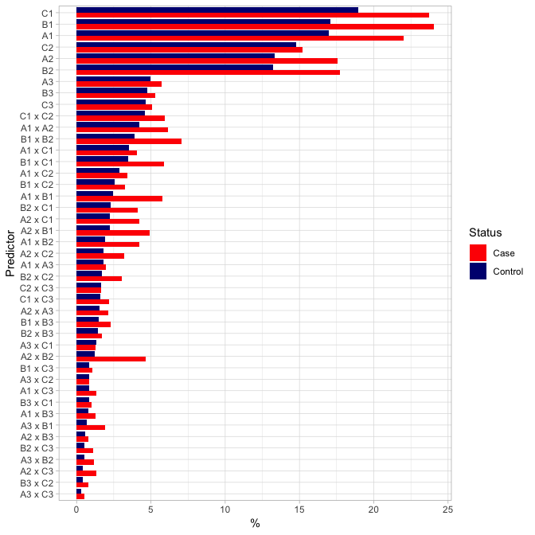
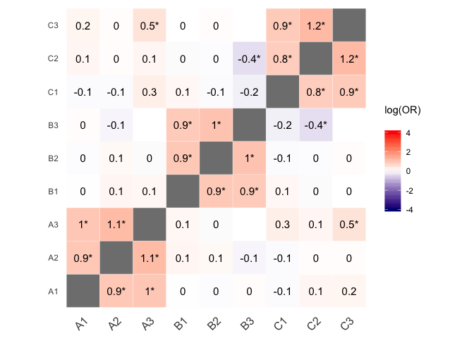

## Introduction
This document shows how the R-functions for producing simulation data, preprocessing data, vizualizing data and performing the analyses are utilized as described in the manuscript 'Data-Driven Identification of Risk Factors and Their Interactions - A Simulation and a Study of Parental and Demographic Risk Factors for Schizophrenia'.  

## Load functions

Clone the repository from <https://github.com/davgyl/dd_ident.git> and load the functions from the R-scripts.  


```r
source("01_load_pkgs.R")
source("02_simdata.R")
source("03_preprocess.R")
source("04_plot_prev.R")
source("05_plot_heatmap.R")
source("06_glmnet.R")
```

\pagebreak  

## Simulate data

Use the `dd_sim`-function to produce simulation data.


```r
# Apply function and set seed for reproducible example
data <- dd_sim(seed = 1000)
# Display data
data
```

```
## # A tibble: 4,500 x 10
##        y    A1    A2    A3    B1    B2    B3    C1    C2    C3
##    <dbl> <dbl> <dbl> <dbl> <dbl> <dbl> <dbl> <dbl> <dbl> <dbl>
##  1     0     0     0     0     0     0     0     0     0     0
##  2     0     0     0     0     0     0     0     0     0     0
##  3     0     0     0     0     0     0     0     0     0     0
##  4     1     0     0     0     1     0     0     1     1     0
##  5     0     1     1     0     0     0     0     0     0     0
##  6     0     0     0     0     0     0     0     1     0     0
##  7     0     0     0     0     0     0     0     0     0     0
##  8     0     0     0     0     1     1     0     0     0     0
##  9     1     0     0     0     0     0     0     1     0     0
## 10     0     0     0     0     0     1     0     0     0     0
## # ... with 4,490 more rows
```

\pagebreak 

## Plot the proportion of predictors

Use the `dd_plot_prop`-function to the proportion of predictors by case-control status. Note that main effects `A1`, `B1` and `C1` are active at OR=1.3 and interaction `A2 x B2` is active at OR=3.  


```r
dd_plot_prop(data)
```

<!-- -->

\pagebreak 

## Plot the log(OR) between main effect variables  
Note that the three groups of variables (A, B, C) are defined to have a within-group correlation in the simulated data.  

```r
dd_heatmap(data, limit = c(-4, 4))
```

<!-- -->


\pagebreak 


## Preprocess data

Use the `dd_preprocess`-function to preprocess data as described in the manuscript.  This will produce a list-object containing three dataframes:  
- The frequencies, prevalence (%) and expected count of predictors  
- The correlational structure of the main effects  
- The preprocessed data with included predictors (main and interaction effects)  


```r
proc_data <- 
  data %>% 
  dd_preprocess()
```


Display the preprocessed data.  


```r
proc_data$data
```

```
## # A tibble: 4,500 x 34
##        y    A1    A2    A3    B1    B2    B3    C1    C2    C3 A1_x_B1
##    <dbl> <dbl> <dbl> <dbl> <dbl> <dbl> <dbl> <dbl> <dbl> <dbl>   <dbl>
##  1     0     0     0     0     0     0     0     0     0     0       0
##  2     0     0     0     0     0     0     0     0     0     0       0
##  3     0     0     0     0     0     0     0     0     0     0       0
##  4     1     0     0     0     1     0     0     1     1     0       0
##  5     0     1     1     0     0     0     0     0     0     0       0
##  6     0     0     0     0     0     0     0     1     0     0       0
##  7     0     0     0     0     0     0     0     0     0     0       0
##  8     0     0     0     0     1     1     0     0     0     0       0
##  9     1     0     0     0     0     0     0     1     0     0       0
## 10     0     0     0     0     0     1     0     0     0     0       0
## # ... with 4,490 more rows, and 23 more variables: A1_x_B2 <dbl>,
## #   A1_x_B3 <dbl>, A1_x_C1 <dbl>, A1_x_C2 <dbl>, A1_x_C3 <dbl>,
## #   A2_x_B1 <dbl>, A2_x_B2 <dbl>, A2_x_B3 <dbl>, A2_x_C1 <dbl>,
## #   A2_x_C2 <dbl>, A2_x_C3 <dbl>, A3_x_B1 <dbl>, A3_x_B2 <dbl>,
## #   A3_x_C1 <dbl>, A3_x_C2 <dbl>, B1_x_C1 <dbl>, B1_x_C2 <dbl>,
## #   B1_x_C3 <dbl>, B2_x_C1 <dbl>, B2_x_C2 <dbl>, B2_x_C3 <dbl>,
## #   B3_x_C1 <dbl>, B3_x_C2 <dbl>
```

\pagebreak

## Variable selection and assessment of associations  

Use the `dd_select`-function to perform variable selection with the elastic net and assess the Bonferroni-corrected p-values and confidence intervals (CI) of the sparse model as described in the manuscript. 
  
In the simulation data, the main effects `A1`, `B1` and `C1` are defined as active at OR=1.3 and the interaction `A2 x B2` is defined active at OR=3.  


```r
dd_select(proc_data$data)$bonf %>% 
  kable
```


Predictor      OR   low_ci   high_ci       p
----------  -----  -------  --------  ------
A1           1.27     0.95      1.68   0.291
B1           1.39     1.05      1.83   0.006
C1           1.32     1.04      1.69   0.009
A1_x_B1      1.42     0.76      2.68   1.000
A2_x_B2      3.58     1.87      7.16   0.000
